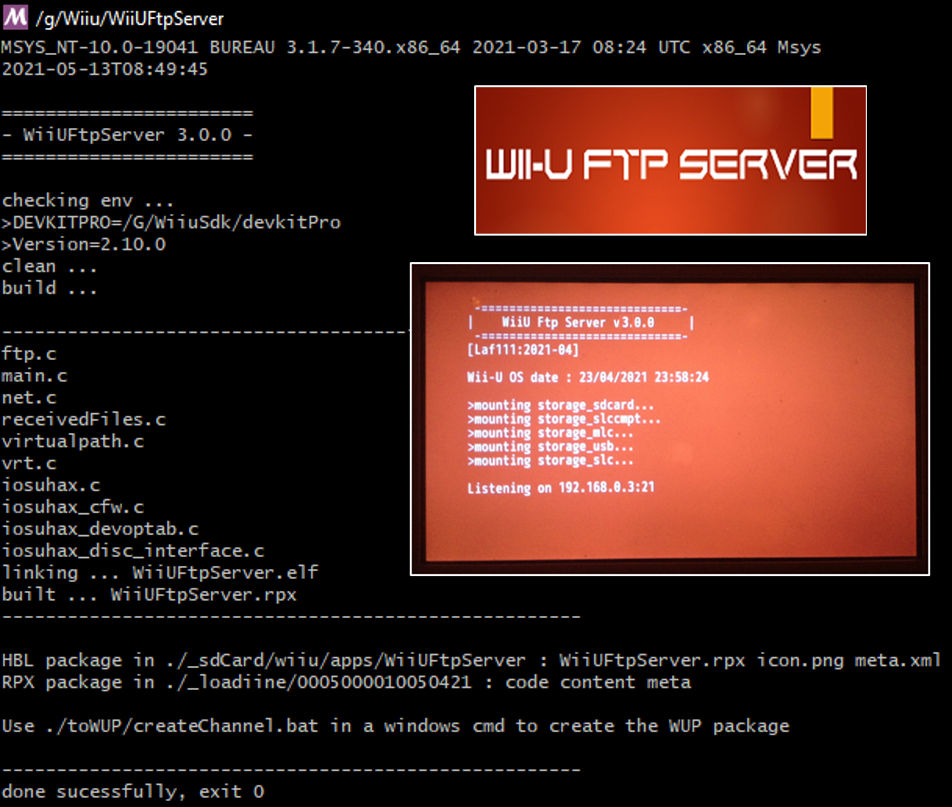
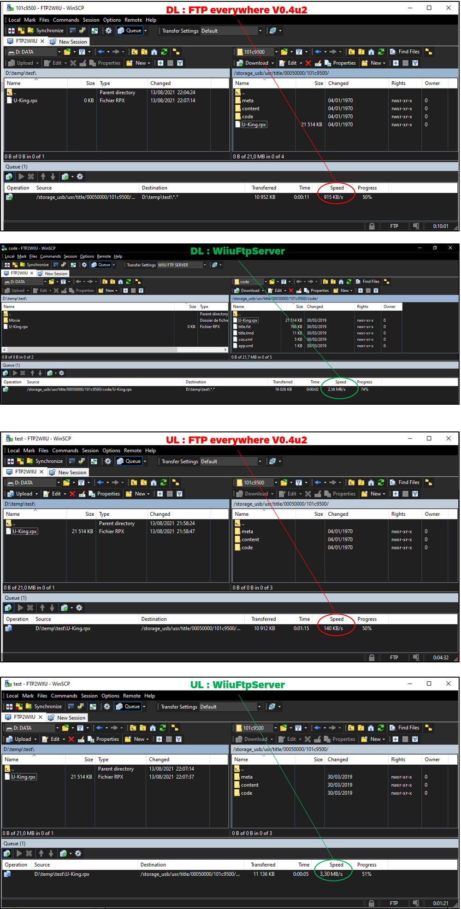
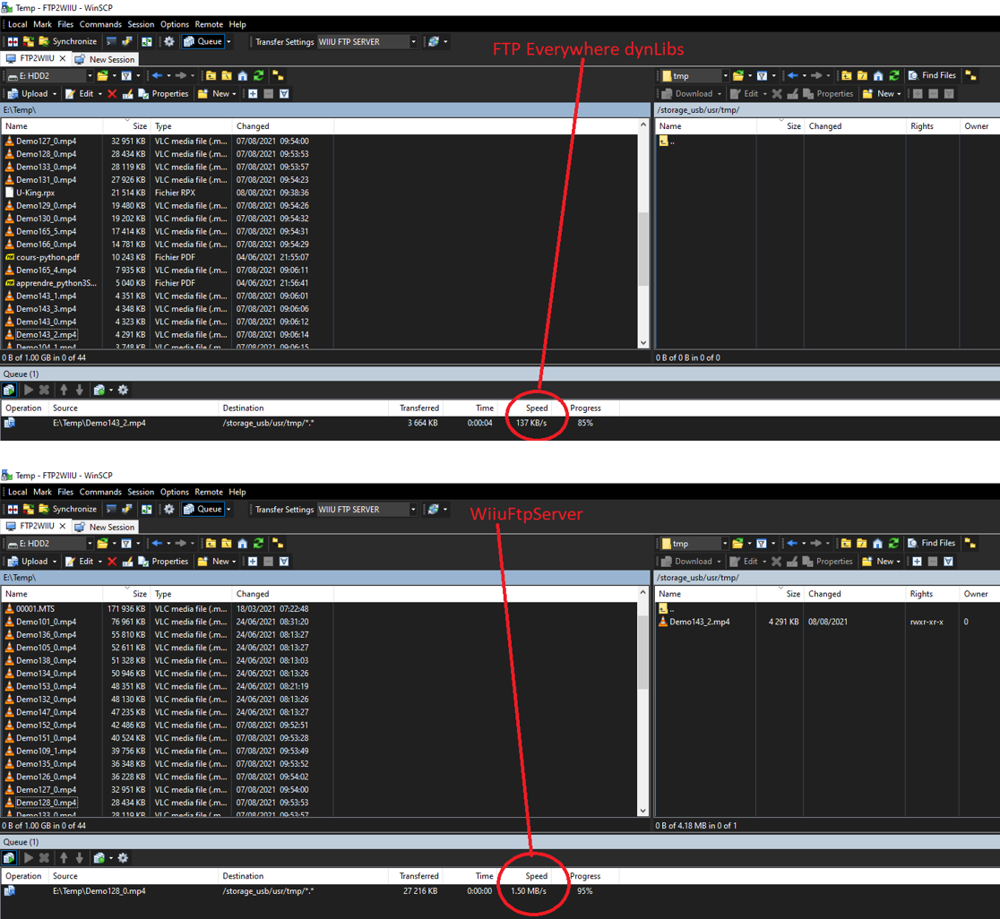
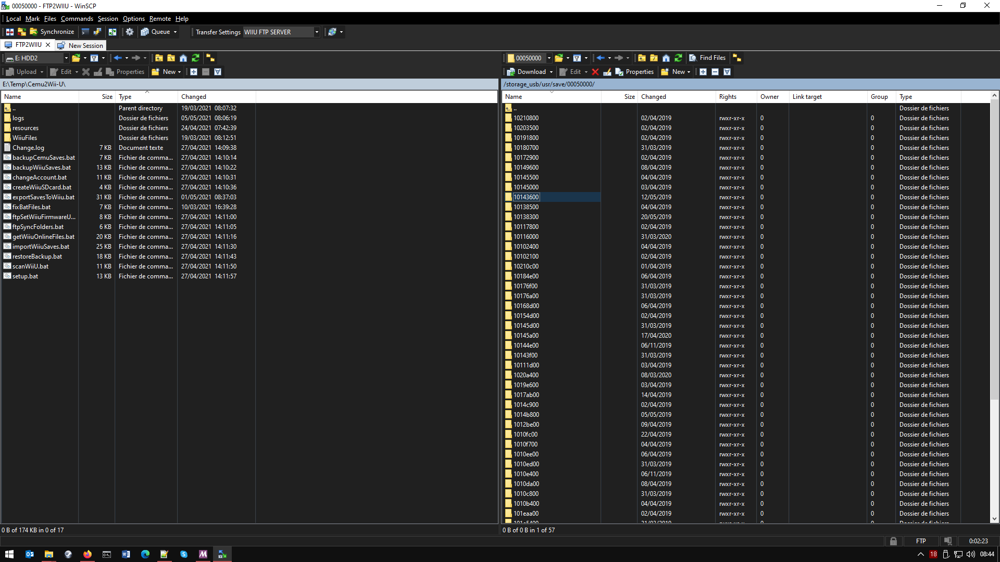

# WiiUFtpServer
A new FTP server for the Wii-U that **fix files injection failures, display files timestamps correctly and use the full bandwith available**.

  

It **fixes remaining files injection failures** when using ftp-everywhere : few games such as WWHD check the save files'rights and refuse to import them if permissions rights are not set using IOSUHAX_FSA_ChangeMode.

I used libWUT for the channel version but kept using **dynamic_libs for the HBL version** because of **greater socket bandwith**. 
This version is **2.5 times faster than FTP everywhere** based on dynamic libs :

  

Gain in **upload mode** is higher : about **10 times faster**

  

Channel version (using WUT) is twice slower than the HBL version but is still faster than FTP everywhere based on dynamic libs (about 30% faster) and twice faster than existing FtpiiU based on WUT.

**NOTES :**

- Use a maximum of 8 concurrents downloads : 1 client connected 8max, 2 clients 4...
- ONLY one for upload (FTPiiU allows only one slot and i prefer to leave it like this, it is more safe in case of more than one client are connected)

- The server does not implement the [MTDM](https://support.solarwinds.com/SuccessCenter/s/article/Enable-the-MDTM-command-to-preserve-the-original-time-stamp-of-uploaded-files?language=en_US) function (and so does not preserves files timestamps) but now displays the correct dates : 

  

But if stat() function fail, current date is displayed. 

- The server (FTP protocol) does not support symlinks. You'll get transfert errors on symlinks that exist on the Wii-U File system in some update or DLC content. Note that CEMU does not use those files and you can just ignore those errors.

- The FTP method used is I/O multiplexing (single threaded non-blocking I/O) like the orginal software (ftpii).

#
# BUILD :

Binairies are available in the [Releases](https://github.com/Laf111/WiiUFtpServer/releases/latest) section.

Comes with all necessary files (emebeded libWut and compile sources of libIOSUHAX). 
No dependencies to set.

The build process creates : HBL app + RPX package (to create a channel)

- Install devkitPro (in DEVKITPRO_PATH)

- Launch "msys2\msys2_shell.bat"

- export DEVKITPRO=$DEVKITPRO_PATH

- cd WiiUFtpServer

- ./build.sh

It creates a HBL App under \_sdCard\wiiu\apps\WiiUFtpServer

To create the channel version (HBC), use "toWUP\createChannel.bat"

Then copy the \_sdCard folder content to your SD card.

