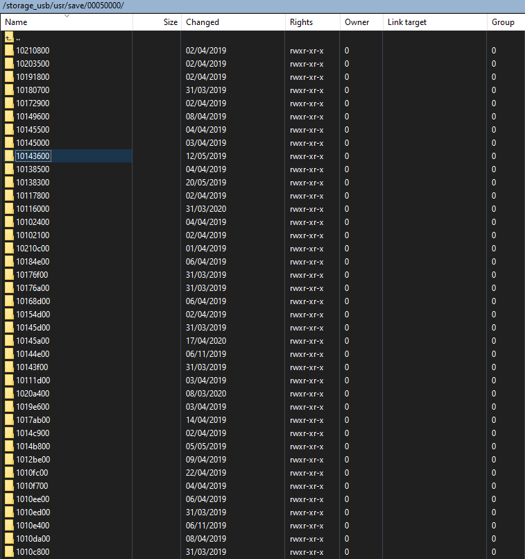

# WiiUFtpServer
FTP server for the Wii-U based on libWUT and libIOSUHAX.

(works with MOCHA and HAXCHI/CBHC)

  

It **fixes remaining files injection failures** when using ftp-everywhere.

Few games such as WWHD check the save files'rights and refuse to import them if permissions rights are not set using IOSUHAX_FSA_ChangeMode.

The **performance (bandwidth)** of the server is close to be **doubled** compared to ftpiiU based on dynamics libs (+ FTP buffer increased in WiiU FTP Server).

I also **disable the power saving feature** when it runs.

  

**NOTES :**

- Use 3 concurents transferts max per client

- The server does not implement the [MTDM](https://support.solarwinds.com/SuccessCenter/s/article/Enable-the-MDTM-command-to-preserve-the-original-time-stamp-of-uploaded-files?language=en_US) function (and so does not preserves files timestamps) but now displays the correct dates : 

  

- The FTP method used is I/O multiplexing (single threaded non-blocking I/O).

#
# BUILD :

Binairies are available in the [Releases](https://github.com/Laf111/WiiUFtpServer/releases/latest) section.

Comes with all necessary files (emebeded libWut and compile sources of libIOSUHAX). 
No dependencies to set.

The build process creates : HBL app + RPX package (to create a channel)

- Install devkitPro (in DEVKITPRO_PATH)

- Launch "msys2\msys2_shell.bat"

- export DEVKITPRO=$DEVKITPRO_PATH

- cd WiiUFtpServer

- ./build.sh

To create the channel version (HBC), use "toWUP\createChannel.bat"

