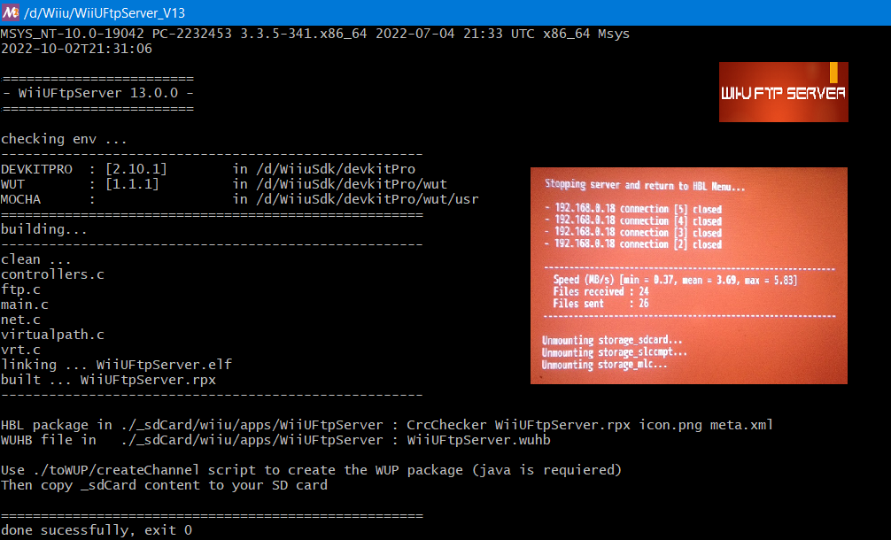

# WiiUFtpServer

  

**A robust and optimized FTP server for the WiiU !**

Based on ftpiiu but with the following issues fixed : 
- **connections failures and crashs**
- file's dates (timestamps)
- **file injection (add rights on files received using IOSUHAX lib)**
- remove the one slot limitation on upload and unlock up to **7 simultaneous transfers (download/upload)**
- **much more faster than the original (over 2.5MB/s in both ways)**

Few games such as WWHD check the save files'rights and refuse to import them if permissions rights are not set using IOSUHAX_FSA_ChangeMode.

WiiuFtpServer comes also with some **extra features** : 

- **support Wiiu PRO and Wiimote controllers**
- **you can choose to disable or enable the power saving feature**
- **enable / disable VERBOSE mode on server side**
- **mount NAND paths only if you ask for it**
- **a network unbrick feature** 
 
By default, NAND paths are not mounted. 

The very first time you mount them, you'll be asked to create a NAND system files backup (to \_sdCard\wiiu\apps\WiiUFtpServer\NandBackup). 

You can choose to create a partial one (< 3MB) or a full (system files only) NAND backup (500MB are requiered on the SD card)

In any case, **only files contained in the partial backup** will be used and **only** to recover the network in case it don't work anymore.

After the restoration process, you will be able to start WiiuFtpServer and unbrick as usual (you can use the full backup files if you don't have a more recent one)

**When using Ethernet** : (Wii-U with Ethernet adapter - NAS - Laptop Ethernet 5)

  

**NOTES :**

- No user/password requiered, only one client allowed with 8 simultaneous transfers max

- The server does not implement the [MTDM](https://support.solarwinds.com/SuccessCenter/s/article/Enable-the-MDTM-command-to-preserve-the-original-time-stamp-of-uploaded-files?language=en_US) function (and so does not preserves files timestamps) but now displays the correct dates : 

  

#
# BUILD :

(Binairies are available in the [Releases](https://github.com/Laf111/WiiUFtpServer/releases/latest) section)

To build from scratch :

- install devkitPro (in DEVKITPRO_PATH)
- get WUT >= beta12 from https://github.com/devkitPro/wut 
- libIOSUHAX from https://github.com/yawut/libiosuhax.

Launch "msys2\msys2_shell.bat" 

- export DEVKITPRO=$DEVKITPRO_PATH

- Build WUT, create $DEVKITPRO_PATH/wut folder and put lib and include folders in

- Build libIOSUHAX, create $DEVKITPRO_PATH/libiosuhax folder and put lib and include folders in

- cd to WiiUFtpServer folder

- ./build.sh

It creates a HBL App under \_sdCard\wiiu\apps\WiiUFtpServer

To create the channel version (HBC), use "toWUP\createChannel.bat"

Then just copy the \_sdCard folder content to your SD card.
